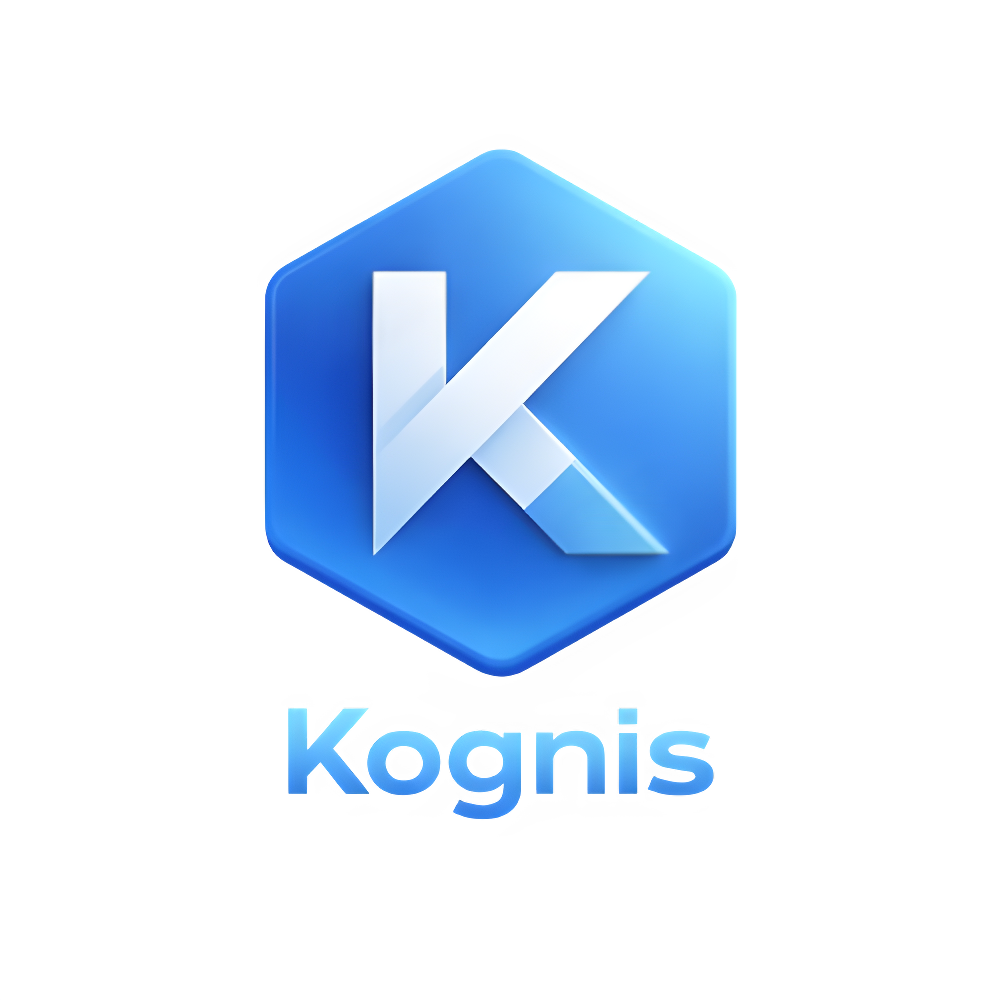

<div align="center">
  

  <br />

  <p>
    
    
    
    
  </p>
</div>

> **Value Proposition**: A modular, offline-first Progressive Web App (PWA) designed to capture real-time training data, process it via a predictive math engine, and persist it locally (IndexedDB) and in the cloud (Supabase). The platform exposes a REST API to feed dynamic, mathematically-backed progressive overload suggestions and muscular balance analytics based on historical performance.

---

## 📑 Table of Contents

- [📑 Table of Contents](#-table-of-contents)
- [📂 Repository Structure](#-repository-structure)
- [👤 Author](#-author)
- [⚙️ Prerequisites \& Environment](#️-prerequisites--environment)
- [🛠️ Modules \& Execution Guide](#️-modules--execution-guide)
  - [Backend (FastAPI Analytics Engine)](#backend-fastapi-analytics-engine)
  - [Frontend (Next.js Offline-First PWA)](#frontend-nextjs-offline-first-pwa)
  - [⚙️ Development Bypass Mode](#️-development-bypass-mode)
- [🏗️ System Architecture](#️-system-architecture)
  - [Data Flow](#data-flow)
- [📚 Best Practices \& Patterns](#-best-practices--patterns)
- [🗓️ Roadmap](#️-roadmap)

---

## 📂 Repository Structure

```text
Kognis/
│
├── backend/                    # Business Logic: Calculates predictions and exposes REST API
│   ├── scripts/                # DB Seeders and mock data generators
│   └── src/
│       ├── api/                # API endpoints (analytics, workouts, goals, profiles)
│       ├── core/               # DB connection, security, and scheduling
│       └── models/             # Pydantic schemas and data validation
│
├── frontend/                   # User Interface: Next.js 16 PWA with Offline-First capabilities
│   ├── public/                 # Static assets and Service Workers (Manifest)
│   └── src/
│       ├── app/                # Next.js App Router (dashboard, workouts, progress)
│       ├── components/         # Reusable UI components (MuscularBalance, MainLayout)
│       ├── hooks/              # Custom React hooks (useSyncManager, useWorkouts)
│       ├── lib/                # IndexedDB configuration (Dexie) and Supabase clients
│       └── store/              # Global state management (AuthContext)
│
├── .pre-commit-config.yaml     # Pre-commit configuration (Git hooks for corrections)
└── README.md                   # Project documentation

```

---

## 👤 Author

* **Pablo Martínez** - *Lead Engineer & Product Developer*

---

## ⚙️ Prerequisites & Environment

Before running any module, ensure the following are installed and configured:

* **Node.js** 18+ and **npm** / **yarn**
* **Python** 3.10+
* **Supabase Account** with a configured PostgreSQL database.
* Two environment files must be configured:
* `backend/.env` (derived from `.env.example`)
* `frontend/.env.local` (derived from `.env.local.example`)


---

## 🛠️ Modules & Execution Guide

The project operates through two decoupled but highly synchronized modules:

### Backend (FastAPI Analytics Engine)

The backend is responsible for data persistence, authentication validation via Supabase RLS, and executing complex Pandas-based analytics (EWMA) for overload prediction.

```bash
cd backend
python -m venv venv
source venv/bin/activate  # Windows: venv\Scripts\activate
pip install -r requirements.txt

# Start the ASGI server
uvicorn src.main:app --reload --port 8000

```

### Frontend (Next.js Offline-First PWA)

The client application utilizes Dexie.js to store data locally and synchronizes with the backend via a background `SyncManager`.

```bash
cd frontend
npm install

# Start the development server
npm run dev

```

### ⚙️ Development Bypass Mode

To facilitate UI/UX development without polluting the production database, Kognis implements a Local Bypass Mode:

1. Set `NEXT_PUBLIC_BYPASS_AUTH="true"` in `frontend/.env.local`.
2. Click **"Login as Test User"** in the UI.
3. The `devSeed.ts` script will autonomously populate Dexie.js with a highly realistic 12-week training history to test charting and analytics without backend dependency.

---

## 🏗️ System Architecture

1. **Client Persistence Layer (IndexedDB)**:
The frontend captures sets, reps, and weights directly into Dexie.js. This guarantees zero-latency interactions and 100% offline functionality.
2. **Background Sync Manager**:
A custom hook (`useSyncManager`) acts as an event broker. It reads pending mutations from IndexedDB, checks network availability, and pushes updates to the FastAPI backend asynchronously.
3. **Analytics Engine (Python/Pandas)**:
The backend queries historical data, calculates the daily 1RM using the Epley formula, applies an Exponentially Weighted Moving Average (EWMA), and returns precise load suggestions.
4. **Data Visualization (Recharts & SVG)**:
The frontend consumes the analytics to render a multi-spoke Radar Chart and a dynamic SVG Heatmap representing weekly training volume per muscle group.

### Data Flow

1. User logs a set `(Offline)` -> Stored in IndexedDB `(Pending Sync)`.
2. Network Restored -> `SyncManager` POSTs payload to FastAPI.
3. FastAPI persists to Supabase (PostgreSQL).
4. User requests Progress -> FastAPI fetches historical data -> Pandas calculates EWMA -> Returns Overload Options -> Rendered in UI.

---

## 📚 Best Practices & Patterns

* **Offline-First Architecture**: Optimistic UI updates with IndexedDB.
* **Hexagonal / Layered API Design**: Decoupled routes, models, and core logic in FastAPI.
* **Glassmorphism & Micro-interactions**: Apple-tier UI/UX using Tailwind CSS (`backdrop-blur`, `active:scale`).
* **Data-Driven Training**: Mathematical approaches (EWMA) to replace guesswork in hypertrophy.
* **Idempotent Data Seeding**: Scripts designed to mock databases securely without duplication.

---

## 🗓️ Roadmap

| Sprint | Objectives | Status |
| --- | --- | --- |
| 1 | Supabase configuration, RLS schemas, and Base Auth | ✅ Done |
| 2 | Dexie.js Integration, SyncManager, and Routine UI | ✅ Done |
| 3 | Analytics Engine (EWMA), Radar Charts & SVG Muscle Heatmap | ✅ Done |
| 4 | User Profiles, Production OAuth (Google), and Global Alerts | ⏳ Pending |

---

© 2026 Kognis - Pablo Martínez
